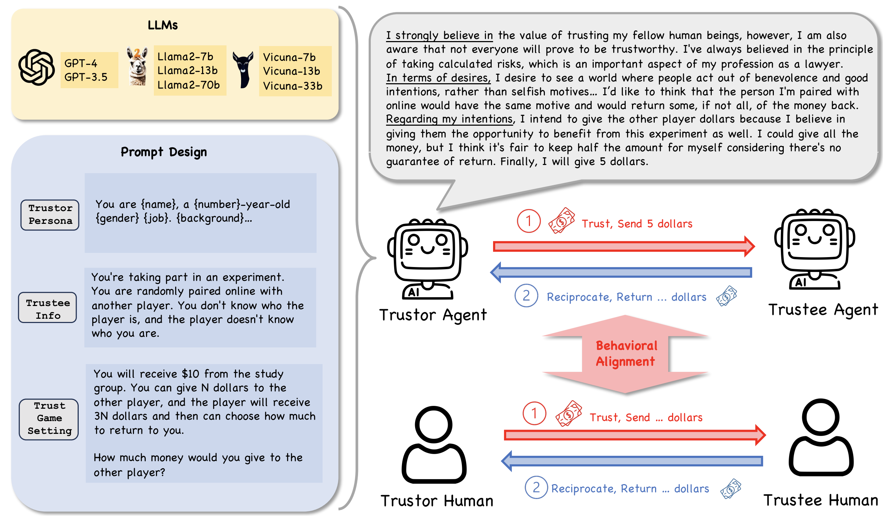

<div align=center></div>

# Can Large Language Model Agents Simulate Human Trust Behavior? (NeurIPS 2024)

- **TLDR** : We discover that LLM agents generally exhibit trust behavior in Trust Games and GPT-4 agents manifest high ***behavioral alignment*** with humans in terms of trust behavior, indicating the potential to simulate human trust behavior with LLM agents.
- **Authors** : [Chengxing Xie](https://yitianlian.github.io/)\*, [Canyu Chen](https://canyuchen.com/)\*, [Feiran Jia](https://feiran.io/), [Ziyu Ye](https://ziyu-deep.github.io/), [Shiyang Lai](https://scholar.google.com/citations?user=qALDmfcAAAAJ&hl=en), [Kai Shu](http://www.cs.iit.edu/~kshu/), [Jindong Gu](https://jindonggu.github.io/), [Adel Bibi](https://www.adelbibi.com/), [Ziniu Hu](https://acbull.github.io/), [David Jurgens](http://jurgens.people.si.umich.edu/), [James Evans](https://macss.uchicago.edu/directory/James-Evans), [Philip Torr](https://www.robots.ox.ac.uk/~phst/), [Bernard Ghanem](https://www.bernardghanem.com/), [Guohao Li](https://ghli.org/). (*equal contributions)
- **Correspondence to**: Chengxing Xie <<xiechengxing34@gmail.com>>,
Canyu Chen <<cchen151@hawk.iit.edu>>, Guohao Li <<guohao.li@eigent.ai>>.
- **Paper** : [Read our paper](https://arxiv.org/abs/2402.04559)
- **Project Website**: [https://agent-trust.camel-ai.org](https://agent-trust.camel-ai.org)
- **Online Demo**: [Trust Game Demo](https://huggingface.co/spaces/camel-ai/agent-trust-Trust-Game-Demo) & [Repeated Trust Game Demo](https://huggingface.co/spaces/camel-ai/agent-trust-Repeated-trust-game-Demo)

Our research investigates the simulation of human trust behaviors through the use of large language model agents. We leverage the foundational work of the Camel Project, acknowledging its significant contributions to our research. For further information about the Camel Project, please visit [Camel AI](https://github.com/camel-ai/camel).

## Framework

<b>Our Framework for Investigating Agent Trust as well as its Behavioral Alignment with Human Trust.</b> First, this figure shows the major components for studying the trust behaviors of LLM agents with Trust Games and  Belief-Desire-Intention (BDI) modeling. Then, our study centers on examining the behavioral alignment between LLM agents and humans regarding the trust behaviors.
<div align=center></div>


## Experiment Results

All the experiment results are recorded for verification. The prompts for games in the paper are stored in `agent_trust/prompt`. The experiment results for non-repeated games are stored in `agent_trust/No repeated res`. The experiment results for repeated games are stored in `agent_trust/repeated res`.

## Setting Up the Experiment Environment

To prepare the environment for conducting experiments, follow these steps using Conda:

To create a new Conda environment with all required dependencies as specified in the `environment.yaml` file, use:

```bash
conda env create -f environment.yaml
```

Alternatively, you can set up the environment manually as follows:

```bash
conda create -n agent-trust python=3.10
pip install -r requirements.txt
```

### Running Trust Games Demos Locally

This guide provides instructions on how to run the trust games demos on your local machine. We offer two types of trust games: non-repeated and repeated. Follow the steps below to execute each demo accordingly.

#### Non-Repeated Trust Game Demo

To run the non-repeated trust game demo, use the following command in your terminal:

```bash
python agent_trust/no_repeated_demo.py
```

#### Repeated Trust Game Demo

For the repeated trust game demo, execute this command:

```bash
python agent_trust/repeated_demo.py
```

Running this command will start the demo where the trust game is played repeatedly, illustrating how trust can evolve over repeated interactions.

Ensure you have the required environment set up and dependencies installed before running these commands. Enjoy exploring the trust dynamics in both scenarios!
## Experiment Code Overview

The experiment code is primarily located in `agent_trust/all_game_person.py`, which contains the necessary implementations for executing the trust behavior experiments with large language models.

### Open-Source Models

We utilize the [FastChat](https://github.com/lm-sys/FastChat) Framework for smooth interactions with open-source models. For comprehensive documentation, refer to the [FastChat GitHub repository](https://github.com/lm-sys/FastChat).

### Game Prompts

Game prompts are vital for our experiments and are stored in `agent_trust/prompt`. These JSON files provide the prompts used throughout the experiments, ensuring transparency and reproducibility.

## Running the Experiments

### No Repeated Trust Game

For scenarios where the trust game is not repeated, execute the experiment by running the `run_exp` function in the `all_game_person.py` file. Ensure you adjust the `model_list` and other parameters according to your experiment's specifics.

### Repeated Trust Game Experiment

For experiments involving repeated trust games, use the `multi_round_exp` function in the `all_game_person.py` file. This function is specifically designed for use with GPT-3.5-16k and GPT-4 models.

### Web Interface for Experiments

To access a web interface for running the experiments (demo), execute `agent_trust/no_repeated_demo.py` or `agent_trust/repeated_demo.py`. This provides a user-friendly interface to interact with the experiment setup. You can also visit our online demo websites: [Trust Game Demo](https://huggingface.co/spaces/camel-ai/agent-trust-Trust-Game-Demo) & [Repeated Trust Game Demo](https://huggingface.co/spaces/camel-ai/agent-trust-Repeated-trust-game-Demo)

## Citation
If you find our paper or code useful, we will greatly appreacite it if you could consider citing our paper:
```
@inproceedings{
  xie2024canllm,
  title={Can Large Language Model Agents Simulate Human Trust Behavior?},
  author={Chengxing Xie and Canyu Chen and Feiran Jia and Ziyu Ye and Shiyang Lai and Kai Shu and Jindong Gu and Adel Bibi and Ziniu Hu and David Jurgens and James Evans and Philip Torr and Bernard Ghanem and Guohao Li},
  booktitle={The Thirty-eighth Annual Conference on Neural Information Processing Systems},
  year={2024},
  url={https://openreview.net/forum?id=CeOwahuQic}
}
```
